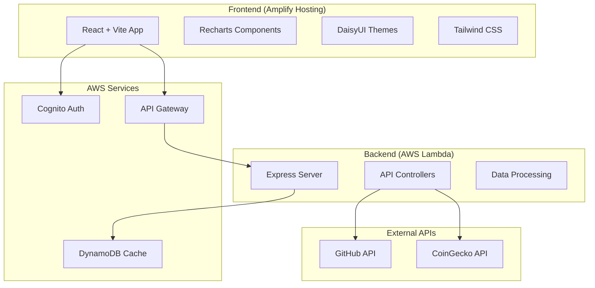

# Design Document

## Overview

The DevCrypto Analytics Dashboard is a full-stack web application that combines data from GitHub's API and CoinGecko's cryptocurrency API to explore correlations between developer productivity and cryptocurrency price movements.

## Architecture

### System Architecture



### Technology Stack

**Frontend:**
- React 18 with TypeScript
- Vite for fast development and building
- Tailwind CSS + DaisyUI for styling
- Recharts for data visualizations
- AWS Amplify for authentication and hosting

**Backend:**
- Node.js with Express framework
- TypeScript for type safety
- Serverless-http for Lambda deployment
- CORS middleware for cross-origin requests

**AWS Services:**
- AWS Cognito - User authentication
- AWS Amplify - Frontend hosting with CI/CD
- AWS Lambda - Serverless backend
- AWS API Gateway - API management
- AWS DynamoDB - Data caching

## Components

### Frontend Pages

- `Dashboard.tsx` - Overview with key metrics and charts
- `GitHubStatsPage.tsx` - Detailed GitHub activity analysis
- `CryptoPage.tsx` - Cryptocurrency price tracking
- `ComparisonPage.tsx` - Correlation analysis views
- `ReportsPage.tsx` - Data export functionality

### Backend API Endpoints

```typescript
GET /api/crypto/coins - List supported cryptocurrencies
GET /api/crypto/price/:coinId - Current price for a coin
GET /api/crypto/:coinId/:days - Historical price data
GET /api/crypto/github/:coinId/:days - GitHub activity for crypto repos
GET /api/crypto/correlation/:coinId/:days - Correlation analysis
```

## Data Models

### Core Data Types

```typescript
interface CryptoCoin {
  id: string;
  name: string;
  symbol: string;
  color: string;
  githubRepo: string;
}

interface CryptoPrice {
  date: string;
  price: number;
  volume: number;
  marketCap: number;
}

interface GitHubActivity {
  date: string;
  commits: number;
  stars: number;
  issues: number;
  pullRequests: number;
}

interface CorrelationResult {
  coinId: string;
  period: number;
  correlations: {
    commits_price: number;
    commits_volume: number;
    pullRequests_price: number;
    stars_price: number;
  };
  confidence: number;
  dataPoints: number;
  interpretation: string;
}
```

## Supported Cryptocurrencies

1. Bitcoin (BTC) - bitcoin/bitcoin
2. Ethereum (ETH) - ethereum/go-ethereum
3. Solana (SOL) - solana-labs/solana
4. Cardano (ADA) - input-output-hk/cardano-node
5. Dogecoin (DOGE) - dogecoin/dogecoin
6. XRP (XRP) - ripple/rippled
7. Polkadot (DOT) - paritytech/polkadot
8. Avalanche (AVAX) - ava-labs/avalanchego
