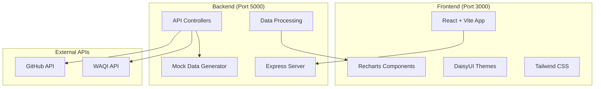

# Design Document

## Overview

The GitHub Activity + Air Quality Dashboard is a full-stack web application that combines data from GitHub's API and the World Air Quality Index API to explore correlations between developer productivity and environmental air quality. The system uses a React frontend with Vite for fast development, a Node.js/Express backend for API orchestration, and modern charting libraries for interactive data visualization.

The application addresses the research question "Does clean air correlate with coding productivity?" by providing statistical analysis tools, interactive visualizations, and data export capabilities across 10 major tech hub cities worldwide.

## Architecture

### System Architecture



### Technology Stack

**Frontend:**
- React 18 with TypeScript for type safety
- Vite for fast development and building
- Tailwind CSS + DaisyUI for styling and themes
- Recharts for interactive data visualizations
- React Icons for consistent iconography
- Axios for HTTP client communication

**Backend:**
- Node.js with Express framework
- TypeScript for type safety
- Axios for external API calls
- Node-cron for scheduled data fetching
- CORS middleware for cross-origin requests
- Rate limiting middleware for API protection

## Components and Interfaces

### Frontend Components

**Core Layout Components:**
- `App.tsx` - Main application wrapper with theme provider
- `Sidebar.tsx` - Collapsible navigation sidebar
- `Header.tsx` - Top navigation with theme switcher
- `TabNavigation.tsx` - Main content area tab switching

**Data Visualization Components:**
- `GitHubActivityChart.tsx` - Line/bar charts for commits, stars, repos
- `AirQualityChart.tsx` - Time series charts for AQI and PM2.5
- `CorrelationChart.tsx` - Scatter plots with trend lines
- `CitySelector.tsx` - Dropdown for selecting tech hub cities
- `TimePeriodSelector.tsx` - Buttons for time range selection

**Page Components:**
- `Dashboard.tsx` - Overview with key metrics and mini-charts
- `CitiesPage.tsx` - City-specific detailed views
- `GitHubStatsPage.tsx` - Detailed GitHub activity analysis
- `AirQualityPage.tsx` - Detailed air quality analysis
- `ComparisonPage.tsx` - Correlation analysis and statistical views
- `ReportsPage.tsx` - Data export and report generation

### Backend API Endpoints

**Data Fetching Endpoints:**
```typescript
GET /api/github/:city/:days - Fetch GitHub activity data
GET /api/airquality/:city/:days - Fetch air quality data
GET /api/correlation/:city/:days - Get correlation analysis
```

**Utility Endpoints:**
```typescript
GET /api/cities - List all supported tech hub cities
GET /api/export/:format/:city/:days - Export data (JSON/CSV)
GET /api/health - System health check
```

### External API Integration

**GitHub API Integration:**
- Repository search by location
- Commit activity aggregation
- Star count tracking
- Rate limit handling (5000 requests/hour)

**WAQI API Integration:**
- City-based air quality stations
- Historical data retrieval
- AQI and PM2.5 measurements
- Rate limit handling (1000 requests/day)

## Data Models

### Core Data Types

```typescript
interface GitHubActivity {
  date: string;
  city: string;
  commits: number;
  stars: number;
  repositories: number;
  contributors: number;
}

interface AirQualityData {
  date: string;
  city: string;
  aqi: number;
  pm25: number;
  station: string;
  coordinates: {
    lat: number;
    lng: number;
  };
}

interface CorrelationResult {
  city: string;
  period: number;
  correlations: {
    commits_aqi: number;
    stars_aqi: number;
    commits_pm25: number;
    stars_pm25: number;
  };
  confidence: number;
  dataPoints: number;
}

interface TechHubCity {
  id: string;
  name: string;
  country: string;
  coordinates: {
    lat: number;
    lng: number;
  };
  timezone: string;
  githubSearchQuery: string;
}
```

### Database Schema (In-Memory Storage)

```typescript
interface DataStore {
  githubCache: Map<string, GitHubActivity[]>;
  airQualityCache: Map<string, AirQualityData[]>;
  correlationCache: Map<string, CorrelationResult>;
  lastUpdated: Map<string, Date>;
}
```

## Correctness Properties

*A property is a characteristic or behavior that should hold true across all valid executions of a system-essentially, a formal statement about what the system should do. Properties serve as the bridge between human-readable specifications and machine-verifiable correctness guarantees.*

Based on the prework analysis, I'll now identify and eliminate redundant properties before writing the final correctness properties:

**Property Reflection:**

After reviewing all testable properties from the prework, I identified several areas of redundancy:

1. **Data Fetching Properties (1.1, 2.1)** - Both test city selection triggering data fetching. These can be combined into one comprehensive property about city-based data fetching.

2. **Chart Rendering Properties (1.2, 2.2, 3.2, 3.3)** - All test that data gets rendered into charts correctly. These can be combined into one property about data visualization.

3. **Time Period Filtering Properties (1.4, 2.4)** - Both test time-based filtering. These can be combined into one property about time period filtering.

4. **Export Properties (5.2, 5.3, 5.5)** - All relate to export functionality. Properties 5.2 and 5.3 can be combined, while 5.5 (filename generation) remains separate.

5. **Round-trip Properties (7.1, 7.2, 7.3, 7.5)** - All relate to serialization/parsing. These can be combined into comprehensive round-trip properties.

6. **Data Transformation Properties (7.4, 8.3, 8.5)** - All test data consistency during transformation. These can be combined into one property about data transformation consistency.

Property 1: City-based data fetching
*For any* tech hub city selection, the system should successfully fetch both GitHub activity data and air quality data with the correct structure and content
**Validates: Requirements 1.1, 2.1**

Property 2: Data visualization rendering
*For any* dataset (GitHub activity, air quality, or correlation data), the system should render appropriate interactive charts with all required visual components
**Validates: Requirements 1.2, 2.2, 3.2, 3.3**

Property 3: Time period filtering
*For any* time period selection (7, 14, 30, 60, or 90 days), the system should filter all displayed data to show only records within that timeframe
**Validates: Requirements 1.4, 2.4**

Property 4: GitHub statistics breakdown
*For any* GitHub activity data, the system should provide accurate detailed breakdowns by repository activity and developer contributions
**Validates: Requirements 1.5**

Property 5: Air quality threshold warnings
*For any* air quality data with AQI values exceeding dangerous thresholds, the system should display appropriate visual warnings
**Validates: Requirements 2.5**

Property 6: Correlation calculation accuracy
*For any* pair of GitHub activity and air quality datasets, the system should calculate mathematically correct statistical correlation coefficients
**Validates: Requirements 3.1**

Property 7: Correlation significance highlighting
*For any* correlation results with high statistical confidence, the system should highlight significant findings with appropriate indicators
**Validates: Requirements 3.4**

Property 8: Correlation data export
*For any* correlation analysis results, the system should generate exports that include all analysis data and metadata
**Validates: Requirements 3.5**

Property 9: UI state synchronization
*For any* time period selection, all charts and data displays should update simultaneously to reflect the chosen timeframe
**Validates: Requirements 4.2**

Property 10: Export data completeness and integrity
*For any* currently displayed data, exports should include all visible metrics and preserve data integrity with appropriate metadata
**Validates: Requirements 5.2, 5.3**

Property 11: Export filename generation
*For any* export operation parameters (city, time period, timestamp), the generated filename should follow the correct naming convention format
**Validates: Requirements 5.5**

Property 12: Mock data indication
*For any* system state where mock data is being used, the user interface should clearly indicate that simulated data is being displayed
**Validates: Requirements 6.2**

Property 13: API response parsing round-trip
*For any* valid GitHub or WAQI API response, parsing then serializing should produce equivalent data structures without loss
**Validates: Requirements 7.1, 7.2, 7.5**

Property 14: Export serialization round-trip
*For any* system data being exported, serializing then parsing the export should produce equivalent data with maintained precision
**Validates: Requirements 7.3**

Property 15: Data transformation consistency
*For any* API response data, transformations between external formats and internal formats should preserve accuracy and use consistent structures
**Validates: Requirements 7.4, 8.3, 8.5**

## Error Handling

### API Error Handling Strategy

**GitHub API Errors:**
- Rate limit exceeded (403): Switch to mock data generator with user notification
- Authentication errors (401): Log error and use cached data if available
- Network timeouts: Implement exponential backoff (1s, 2s, 4s, 8s) before fallback
- Invalid responses: Validate JSON schema and reject malformed data

**WAQI API Errors:**
- Rate limit exceeded: Use mock data with clear indicators
- City not found (404): Display error message and suggest alternative cities
- Service unavailable (503): Cache last known good data with staleness indicators
- Data parsing errors: Log errors and exclude invalid measurements

**Frontend Error Boundaries:**
- Chart rendering failures: Display error message with data export option
- Component crashes: Graceful degradation with error reporting
- Network connectivity: Offline mode with cached data display

### Data Validation

**Input Validation:**
- City selection: Validate against predefined list of tech hub cities
- Time period: Ensure values are within allowed range (7-90 days)
- Export format: Validate format parameter (JSON/CSV only)
- Date ranges: Ensure start date is before end date

**Data Integrity Checks:**
- GitHub metrics: Validate non-negative integers for counts
- Air quality: Ensure AQI values are within valid range (0-500)
- Correlation coefficients: Validate range (-1 to 1) and handle NaN cases
- Timestamps: Validate ISO 8601 format and reasonable date ranges

## Testing Strategy

### Dual Testing Approach

The system will use both unit testing and property-based testing to ensure comprehensive coverage:

**Unit Tests:**
- Test specific examples and edge cases
- Verify integration points between components
- Test error conditions and boundary values
- Mock external API responses for consistent testing

**Property-Based Tests:**
- Verify universal properties across all valid inputs
- Use QuickCheck-style testing with random data generation
- Run minimum 100 iterations per property test
- Each property test tagged with: **Feature: github-air-quality-dashboard, Property {number}: {property_text}**

**Testing Framework:**
- **Frontend**: Jest + React Testing Library for unit tests, fast-check for property-based testing
- **Backend**: Jest + Supertest for API testing, fast-check for property-based testing
- **Integration**: Cypress for end-to-end testing scenarios

**Property Test Configuration:**
- Minimum 100 iterations per property test
- Custom generators for GitHub activity data, air quality measurements, and city selections
- Shrinking enabled to find minimal failing cases
- Timeout of 30 seconds per property test

**Test Data Generators:**
- GitHub activity: Random commits (0-1000), stars (0-10000), repositories (1-100)
- Air quality: AQI values (0-500), PM2.5 measurements (0-200)
- Cities: Random selection from predefined tech hub cities
- Time periods: Random selection from allowed values (7, 14, 30, 60, 90)
- Dates: Random dates within last 2 years for historical data

Each correctness property will be implemented by a single property-based test, with clear traceability back to the requirements document through the validation tags.